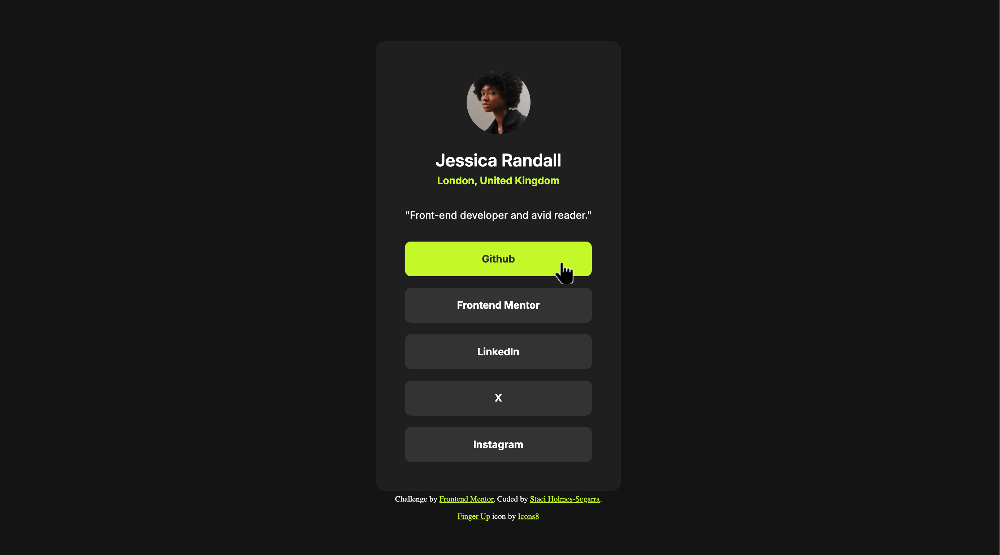

# Frontend Mentor - Social links profile solution

This is a solution to the [Social links profile challenge on Frontend Mentor](https://www.frontendmentor.io/challenges/social-links-profile-UG32l9m6dQ). Frontend Mentor challenges help you improve your coding skills by building realistic projects.

## Table of contents

- [Overview](#overview)
  - [The challenge](#the-challenge)
  - [Screenshot](#screenshot)
  - [Links](#links)
- [My process](#my-process)
  - [Built with](#built-with)
  - [What I learned](#what-i-learned)
  - [Continued development](#continued-development)

## Overview

### The challenge

Users should be able to:

- See hover and focus states for all interactive elements on the page

### Screenshot

Social Links Profile Card

   

Social Links Profile Card with Hover

### Links

- Solution URL: [https://github.com/Stacihs/social-links-profile](https://github.com/Stacihs/social-links-profile)
- Live Site URL: [https://socialmedialinksdemo.netlify.app](https://socialmedialinksdemo.netlify.app)

## My process

### Built with

- Semantic HTML5 markup
- CSS custom properties
- Flexbox
- Mobile-first workflow

### What I learned

In the past, I've used variable font static pages. This time is used the variable file. I learned how flexible this is and, as always, you still need to add a fallback font to account for browsers where this is not supported.

### Continued development

After I get more comfortable with the fundamentals of CSS, I plan on exploring CSS frameworks, such as Bootstrap and Tailwind.
